# Лабораторная работа №4. Настройка и применение криптографических протоколов

Выполнил Мерзликин Максим, ББМО-01-23

## Создание ключевой пары GPG

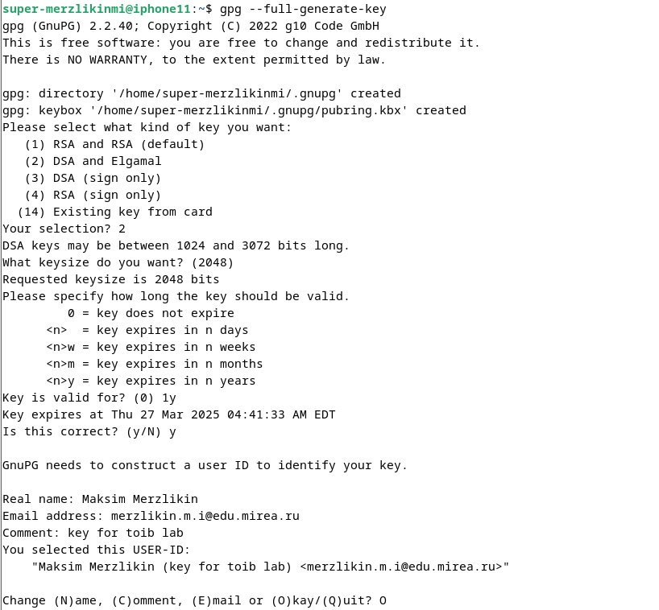
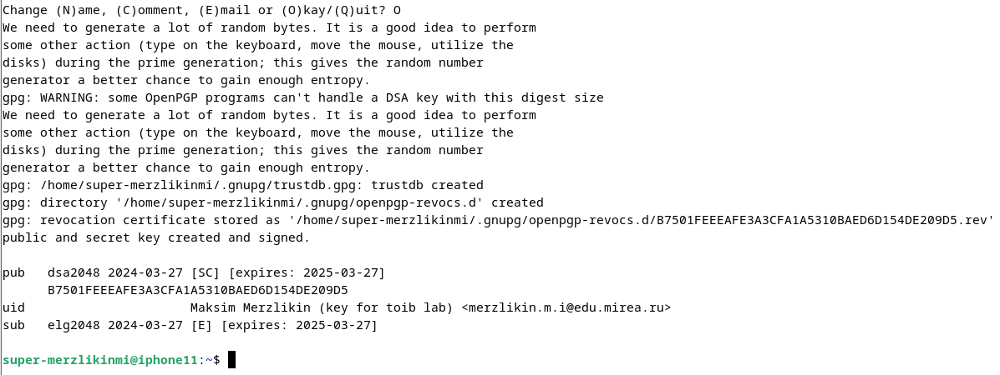

## Просмотр созданных ключей, подписей, отпечатков

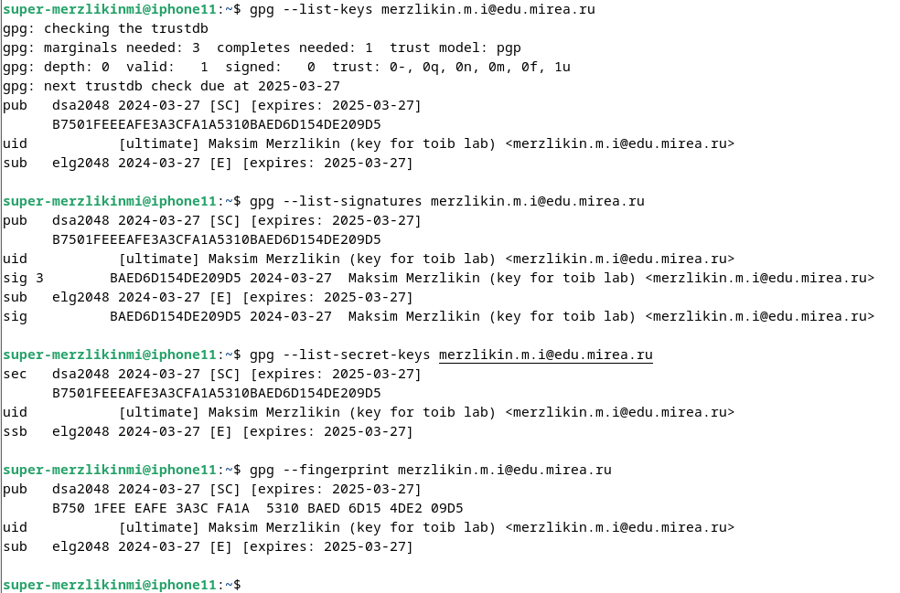

## Создание отзывающего сертификата

Вывод сертификата в `stdout`:

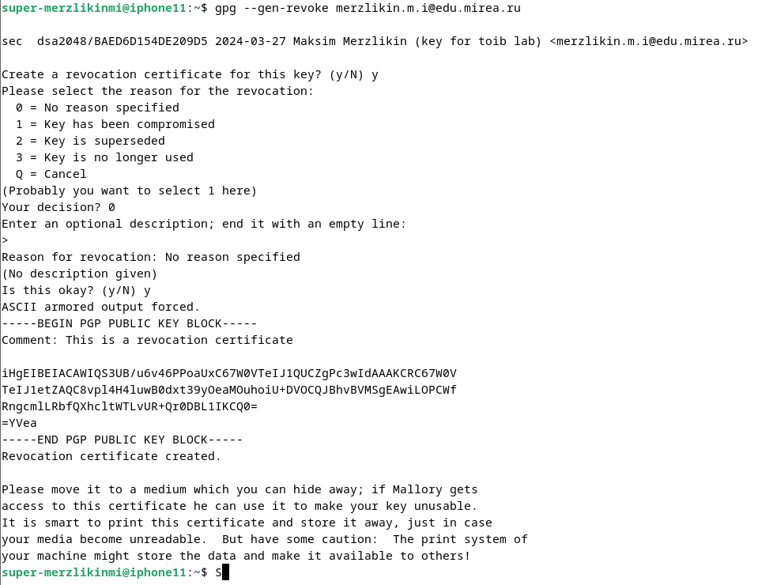

Запись сертификата в файл: 

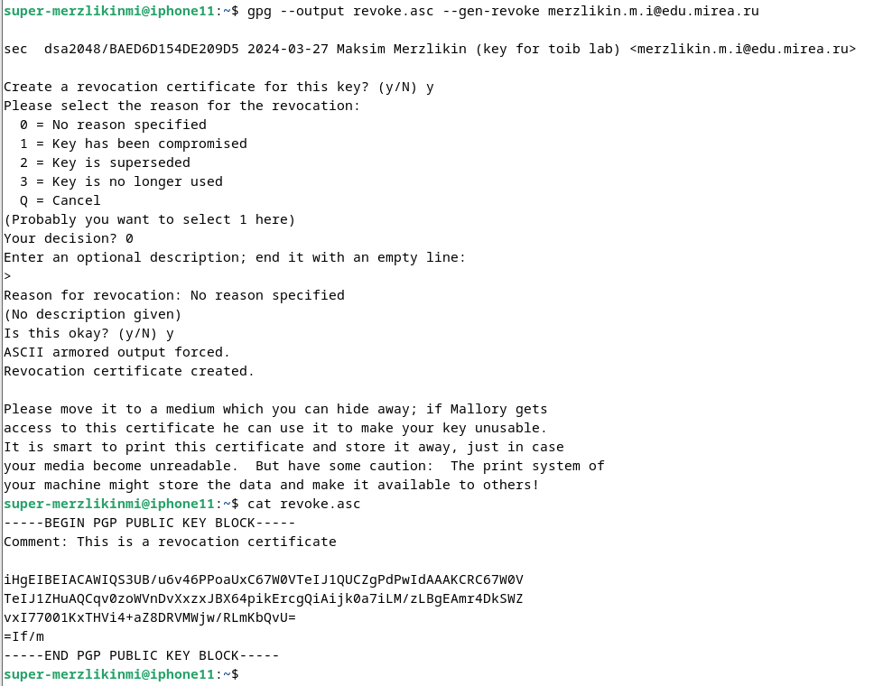

## Экспорт публичного ключа в бинарном и текстовом виде

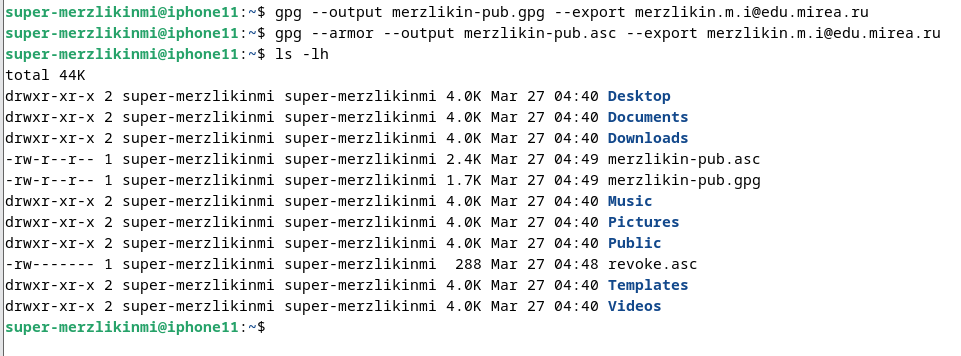
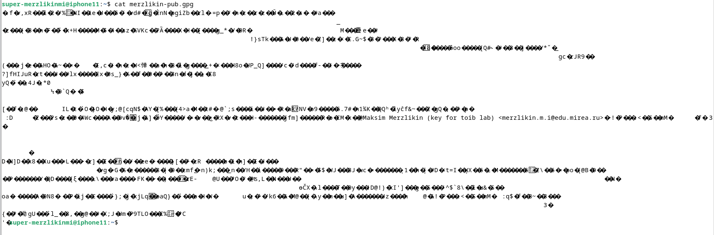
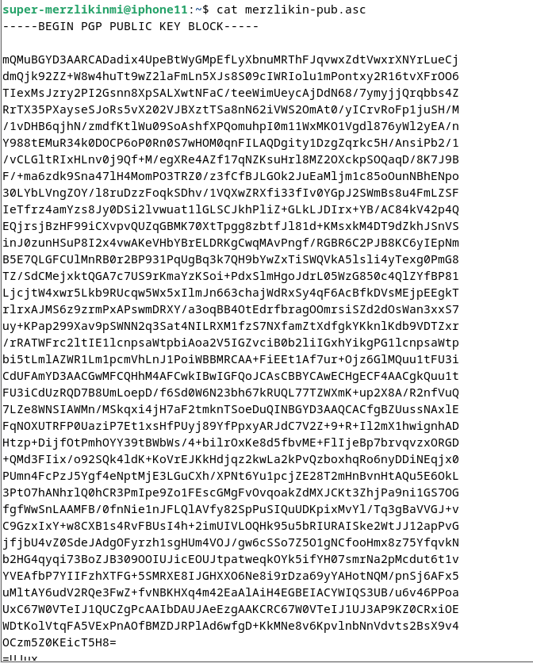

## Создание файла для подписи

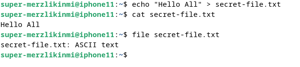

## Создание цифровой подписи в бинарном виде

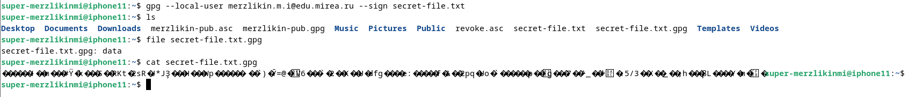

## Проверка подписи

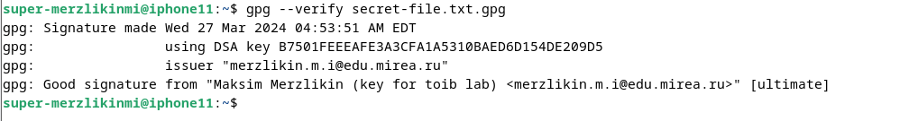

## Создание цифровой подписи в формате ASCII

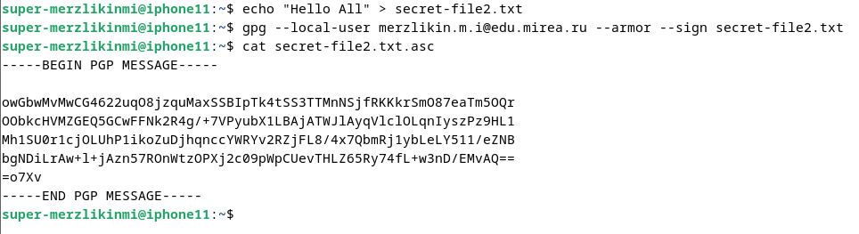

## Создание цифровой подписи, вставленной в содержимое файла

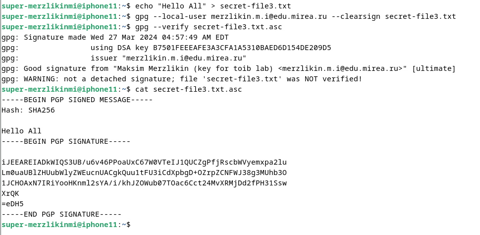
