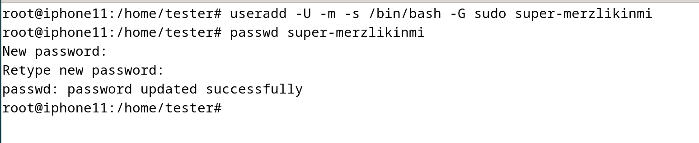
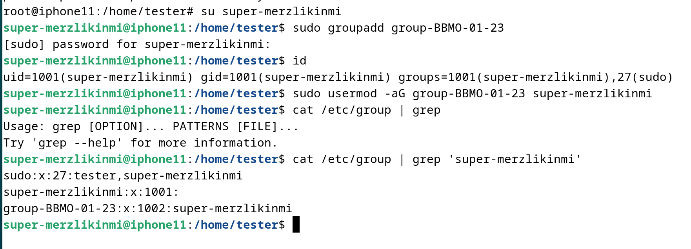
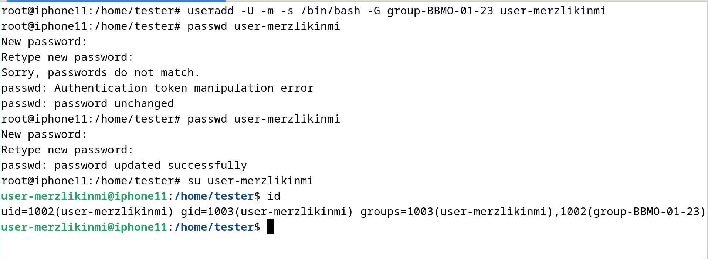
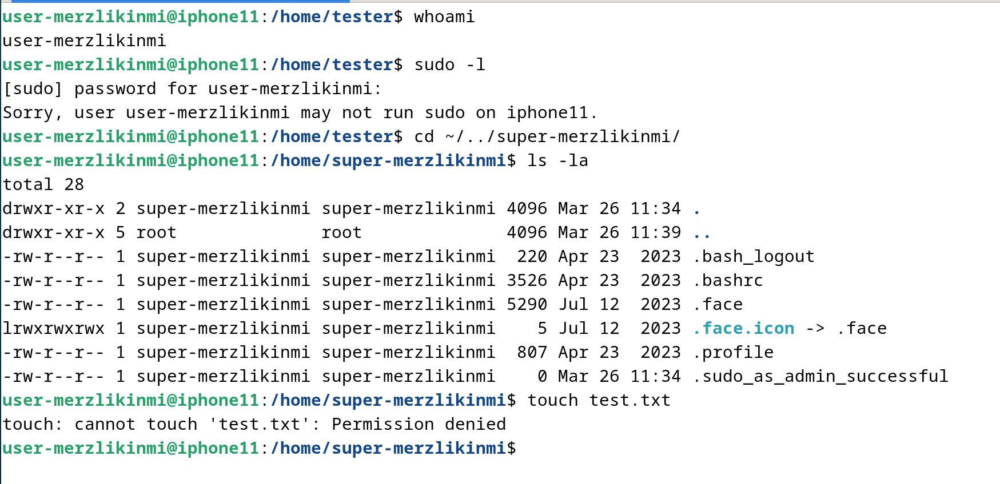
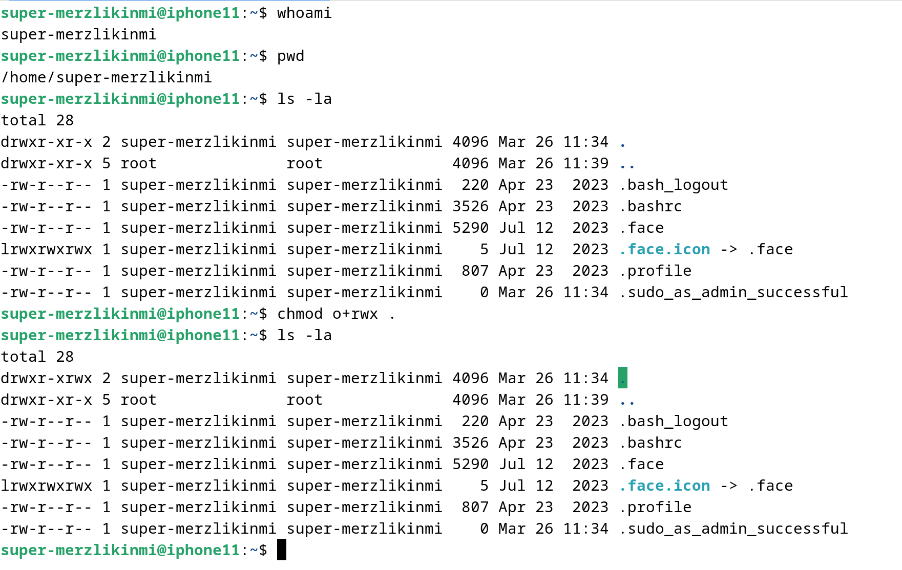
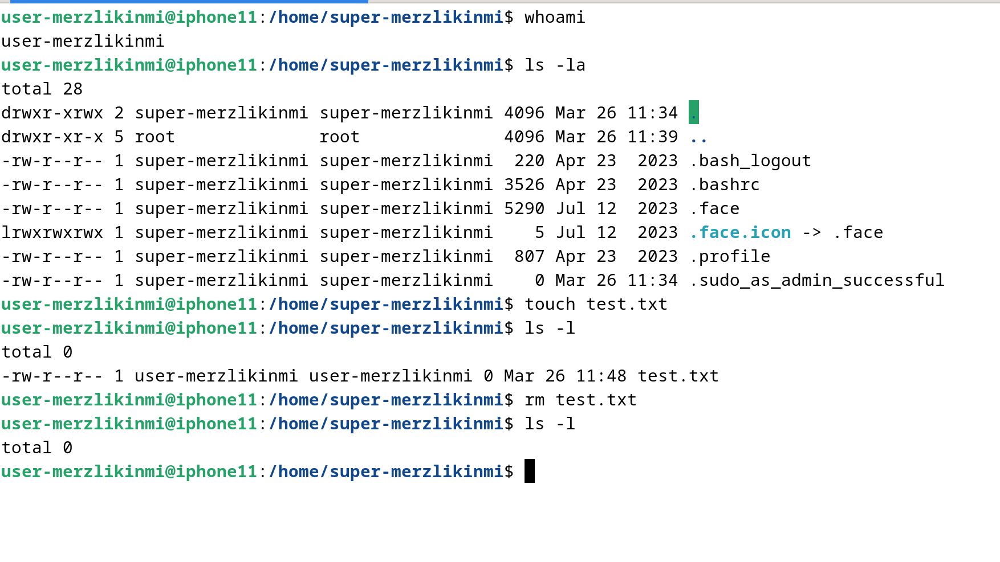

# Практическое задание №2

## Создание суперпользователя

## Создание группы `group-BBMO-01-23`, добавление ранее созданного пользователя в группу

## Создание обычного пользователя с добавлением в ранее созданную группу

## Демонстрация отсутствия привилегий на создание файлов в домашнем каталоге суперпользователя

## Наделение полномочиями по созданию и удалению файлов в домашней директории суперпользователя

## Проверка работы новых полномочий у обычного пользователя

