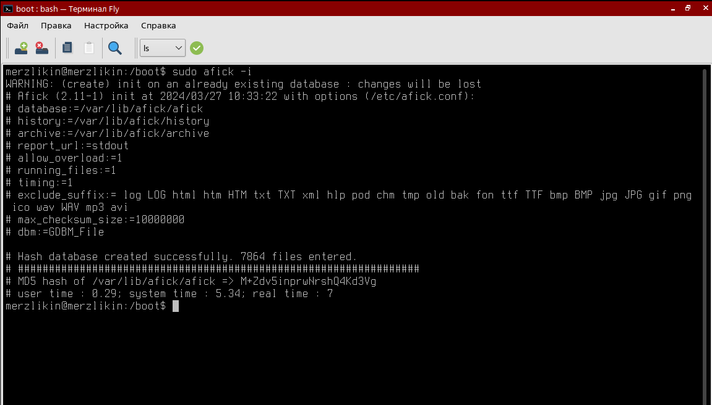

# Практическое задание №5. Контроль целостности.

Выполнил Мерзликин Максим, группа ББМО-01-23

## Подготовленная ВМ с ОС Astra Linux SE 1.7

## Проверка работы МКЦ

## Создание файла, которому будет присвоена метка целостности

## Добавление метки созданному файлу

## Попытка записи в файл в сессии с низким уровнем целостности

## Проверка работы замкнутой программной среды

## Блокировка выполнения неподписанного файла

## Подсчёт контрольной суммы файла утилитой `gostsum`

## Инициализация `afick`

## Отслеживание изменений в ФС с помощью `afick`

